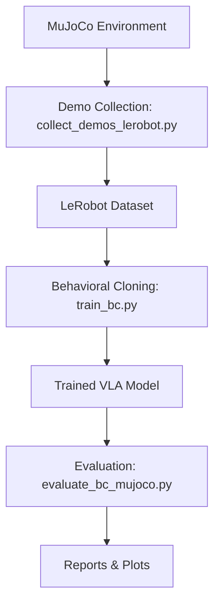

# Reinforcement Learning for Adaptive Robotic Manipulation — Milestone 1: Vision–Language–Action (Behavioral Cloning)

## Project Overview
This milestone delivers the baseline for our COMS 4733 robotics project: a Vision–Language–Action (VLA) policy that maps camera observations and natural-language instructions to 7-DoF joint-velocity commands for a Franka Panda arm. The policy is trained via Behavioral Cloning on MuJoCo demonstrations stored in LeRobot format, using DINOv2 for vision and BERT for language. The resulting model serves as the starting point for later reinforcement-learning fine-tuning under static and hindered tabletop manipulation scenarios.

## Repository Structure
```
project/
├── env/
│   ├── mujoco_env.py
│   └── mujoco_assets/franka_scene.xml
├── data/
│   ├── collect_demos_lerobot.py
│   ├── lerobot_dataset.py
│   └── validate_dataset_schema.py
├── models/vla_dinov2.py
├── configs/openvla_dinov2_bc.yaml
├── train_bc.py
├── evaluate_bc_mujoco.py
├── rl/ppo_config.yaml
├── results/
├── runs/
└── reports/milestone1_report.md
```
- **env/** – MuJoCo environment, control utilities, and XML assets for the Franka scene.
- **data/** – Demonstration collector, LeRobot dataset loader, and dataset validator.
- **models/** – VLA architecture combining DINOv2, BERT, proprio encoder, and fusion transformer.
- **configs/** – YAML configurations for training and evaluation.
- **train_bc.py / evaluate_bc_mujoco.py** – Entry points for Behavioral Cloning and MuJoCo evaluation.
- **rl/** – Placeholder PPO configuration for Milestone 2 fine-tuning.
- **results/** – Saved CSV metrics and plots from evaluation.
- **runs/** – Training checkpoints and logs.
- **reports/** – Milestone documentation template.

## Full Pipeline Overview

1. **Simulate** the Franka Panda pick-and-place task in MuJoCo (static and hindered).
2. **Collect** approximately 400 static + 100 hindered demonstrations in LeRobot format.
3. **Train** the VLA policy with Behavioral Cloning using DINOv2 vision and BERT language encoders.
4. **Evaluate** success rates in static and hindered modes, recording metrics and plots.
5. **Prepare** milestone report, figures, and checkpoints for downstream RL fine-tuning.

## Environment & Scene Details
| Component     | Details                                      |
| ------------- | -------------------------------------------- |
| Simulator     | MuJoCo 3.1+                                  |
| Robot         | Franka Panda 7-DoF arm                       |
| Task          | Pick-and-place colored balls into bin        |
| Workspace     | Table + 3 balls (red, green, blue) + bin     |
| Camera        | Top-mounted 224×224 RGB                      |
| Hindered Mode | Lighting noise + occlusion + distractor cube |

The `env/mujoco_assets/franka_scene.xml` file defines the robot, workspace, cameras, lighting, and hindrance objects used during simulation resets.

## Installation Instructions
```bash
# Clone repository
git clone <repo-url>
cd project

# (Recommended) Create conda environment
conda create -n rl-vla python=3.10 -y
conda activate rl-vla

# Install requirements
pip install -r requirements.txt
# or install packages manually
pip install torch torchvision transformers mujoco mujoco-python-viewer dm-control numpy opencv-python pandas matplotlib lerobot
```
Notes:
- Install `mujoco-python-viewer` when GUI rendering is desired; omit it for headless usage.
- Set `gui=False` when creating the environment for headless training and evaluation.

## Using the MuJoCo Simulator
Smoke-test the environment:
```bash
python -m env.mujoco_env
```
Programmatic usage:
```python
from env.mujoco_env import FrankaPickPlaceEnv

env = FrankaPickPlaceEnv(gui=True)   # interactive viewer
env = FrankaPickPlaceEnv(gui=False)  # headless off-screen rendering
obs = env.reset()
print(obs.keys())  # {'rgb_static', 'proprio', ...}
```
Observation shapes:
```python
{
  "rgb_static": (3, 224, 224),  # Float32, normalized to [0, 1]
  "proprio": (7,)                 # Joint positions (rad) for 7-DoF arm
}
```

## Generating Demonstrations
Collect static and hindered demonstrations:
```bash
python data/collect_demos_lerobot.py --episodes 500
```
Output directory structure:
```
dataset/
 ├── episode_0000/
 │   ├── obs/rgb_static/*.png
 │   ├── obs/proprio.npy
 │   ├── actions.npy
 │   ├── instruction.txt
 │   └── meta.json
 └── metadata.json
```
Approximately 20 % of the episodes are generated with `hindered=True`, adding lighting perturbations and occluders.

## Validate Dataset
```bash
python data/validate_dataset_schema.py --dataset ./dataset
```
The validator checks for missing files, shape mismatches, temporal alignment, timestamp ordering, and image resolution (224×224).

## Train Behavioral Cloning Model
```bash
python train_bc.py --config configs/openvla_dinov2_bc.yaml
```
Key configuration (from `configs/openvla_dinov2_bc.yaml`):
- Vision encoder: `facebook/dinov2-base`
- Language encoder: `bert-base-uncased`
- Fusion module: 2-layer transformer with 512 hidden units
- Action head: Linear map (512 → 7 joint velocities)
- Loss: Mean-squared error
- Optimizer: Adam with learning rate 1e-4, batch size 32

Expected behavior:
- Training loss decreases below ≈0.02 on held-out validation batches.
- Checkpoints saved under `runs/` (e.g., `dinov2_bc_epochXX.pt`).
- Console logs and optional TensorBoard/W&B metrics capture training curves.

## Evaluate Model
Static evaluation:
```bash
python evaluate_bc_mujoco.py --mode static
```
Hindered evaluation:
```bash
python evaluate_bc_mujoco.py --mode hindered
```
Artifacts produced:
```
results/static_eval.csv
results/hindered_eval.csv
results/comparison_plot.png
```
Metrics include episode success rate (target ≥60 % in static mode) and the hindered performance drop (≤20 % gap).

## Expected Results & Report
- Static success rate ≈0.60 or higher.
- Hindered success rate ≈0.40–0.50.
- Loss curves and static vs. hindered plots stored in `results/`.
- Summaries, figures, and analysis compiled in `reports/milestone1_report.md` (export to PDF as needed).

## Preparing for Milestone 2
Milestone 2 will fine-tune this BC policy with PPO using the same MuJoCo environment and dataset interfaces. Configuration stubs for RL experiments live in `rl/ppo_config.yaml`.

## Example Run Pipeline Summary
```bash
# 1. Collect demonstrations
python data/collect_demos_lerobot.py --episodes 500

# 2. Validate dataset
python data/validate_dataset_schema.py --dataset ./dataset

# 3. Train BC model
python train_bc.py --config configs/openvla_dinov2_bc.yaml

# 4. Evaluate
python evaluate_bc_mujoco.py --mode static
python evaluate_bc_mujoco.py --mode hindered

# 5. View report
open reports/milestone1_report.md
```

## Credits & References
- **Team:** Nihal Singh, Edwin Argudo, Ekansh Gupta
- **Course:** COMS 4733 — Machine Learning for Robotics (Columbia University)
- **Frameworks:** LeRobot, PyTorch, Transformers, MuJoCo
- **Vision Encoder:** `facebook/dinov2-base`
- **Language Encoder:** `bert-base-uncased`
